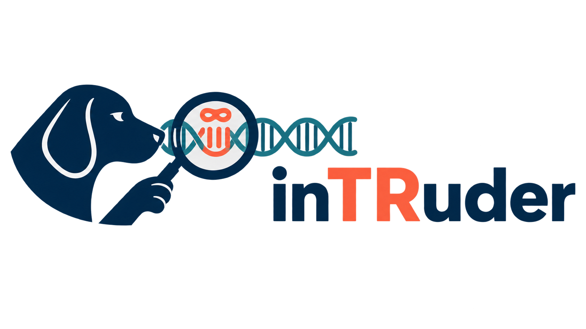

# inTRuder

[](.python-version)
[](https://docs.astral.sh/uv/)
[](renv.lock)
[](https://rstudio.github.io/renv/)
[](https://www.nextflow.io/)
[](https://github.com/fritzsedlazeck/Sniffles)
[](LICENSE)

<p align="center">
  
</p>

## Overview

Tandem repeat (TR) genotypers rely on a catalog of known loci and motifs, and that catalog is
built by annotating repeats in the reference genome — so any TR that's individual- or
population-specific is invisible to it from the start. We distinguish two kinds of novelty:

- **Novel locus** — present in an individual, absent from the reference genome entirely.
- **Novel motif** — the locus exists in the reference, but the individual carries a different
  repeat motif there.

Finding these normally means whole-genome assembly, which is expensive to run just to surface
non-reference sequence. inTRuder takes a cheaper route: long-read structural variant (SV) callers
already detect insertions accurately as a standard part of most long-read workflows, and an
expanded TR is, by construction, a repetitive subset of those insertions. Scanning the inserted
sequence itself — rather than assembling the whole genome — is enough to surface candidate TR
expansions, including ones no existing catalog knows about.

**Pipeline stages:**

1. **Preprocessing** *(upstream, assumed already done)* — alignment ([minimap2](https://github.com/lh3/minimap2)),
   SNV calling ([Clair3](https://github.com/HKU-BAL/Clair3)), haplotagging
   ([WhatsHap](https://github.com/whatshap/whatshap)), SV calling
   ([Sniffles2](https://github.com/fritzsedlazeck/Sniffles)), joint SV calling/merging (Sniffles2)
2. **TR detection** — find tandem repeats within inserted allele sequences
   ([`pytrf`](https://github.com/lmdu/pytrf)), filtering out homopolymers and low-purity or
   low-coverage calls
3. **Novelty assessment** — flag which candidate loci/motifs are absent from the reference genome
   and known TR catalogs
4. **Annotation** — genic and clinical context ([`AnnotSV`](https://github.com/lgmgeo/AnnotSV)),
   known-TR/disease-locus comparison ([STRchive](https://github.com/dashnowlab/STRchive))
5. **Validation** — compare calls against high-quality HPRC long-read assemblies and trio data

See [Methods outline](docs/Methods_overview.md) for the full write-up of each stage.

## Table of Contents

- [Overview](#overview)
- [Important Links](#important-links-hackathon-purposes---to-delete-on-friday)
- [Quickstart guide](#quickstart-guide)
- [Repository layout](#repository-layout)
- [Documentation](#documentation)
  - [Data](#data)
  - [Tools](#tools)
  - [Code and environments](#code-and-environments)
- [Web interface (proof of concept)](#web-interface-proof-of-concept)
- [Flowchart](#flowchart)
- [Contributing](#contributing)
- [Team](#team)

## Important Links (Hackathon purposes - to delete on Friday!)

- [Slack](https://baylorncbisvc-1jk9469.slack.com/archives/C0BRNLZDTL3) `#2026_group2_group10_tandem_repeats`
- [Hackathon Schedule](https://docs.google.com/document/d/1XlZMGJdudr1C0jS9j1bWgZh4_OWm9lE0Qm8pbTQVRd8/edit?usp=sharing)
- [Zoom](https://cuanschutz.zoom.us/j/94705840498)
- [Team roles and subgroups](https://docs.google.com/document/d/17ginimXqbUi-xEAUXwJttZUjnYb8Fi3xF4hUsY9ry7k/edit?tab=t.0)
- [Shared Google Drive Directory](https://drive.google.com/drive/folders/1jXJAgrP3To92SYn5w0bqxMdEu0wF66nd?usp=sharing)
    - [Hackathon Paper Draft](https://docs.google.com/document/d/10qZ_TYCXGT-6oQeLkNYA6dTP95qblCw60p-mwLw-pfY/edit?usp=sharing)
    - [Detailed project proposal, including background](https://docs.google.com/document/d/18JEbKyxauTkjYTZojyhRf58wiZ7YvwZixZ-JOBXl74c/edit?usp=sharing)

## Quickstart guide


## Repository layout

```
novelTRs/
├── src/
│   ├── python/        # core TR-detection + novelty annotation pipeline (uv-managed)
│   └── R/              # R analysis code (renv-managed)
├── scripts/
│   ├── dnanexus/      # rent a DNAnexus box, run something on it, terminate it
│   └── merge-SV/       # Sniffles single- and multi-sample SV merging runs
├── notebooks/          # Jupyter and R Markdown / Quarto notebooks
├── frontend/            # Next.js web interface (proof of concept)
├── backend/              # FastAPI + LangGraph service backing the web interface
├── docker/                # Container images for frontend/backend
├── data/                   # Sample lists, SV output, catalogs (mostly gitignored)
├── docs/                    # Data, tool and methods documentation
├── tests/                    # Python tests
└── justfile                   # task runner — `just` lists all recipes
```

## Documentation

### Data

| Document | Contents |
|---|---|
| [67-genome HPRC cohort](docs/data/67_genome_HPRC_cohort.md) | Cohort composition, read extraction and alignment, Sniffles2 SV calling and filtering, data availability |
| [UCSC hg38 Simple Repeats (TRF)](docs/data/UCSC_hg38_Simple_TRF_Repeats.md) | Reference TR annotation used for comparison — download, column schema, coordinate conventions, provenance |
| [`data/aws_hprc_cram.list`](data/aws_hprc_cram.list) | AWS S3 locations of the processed HPRC CRAM files |
| [`data/aws_giab_cram.list`](data/aws_giab_cram.list) | AWS S3 locations of the processed GIAB CRAM files |
| [`data/sv_output/`](data/sv_output/) | Per-sample raw and filtered Sniffles VCFs, plus the merged multi-sample VCF subset |

### Tools

| Document | Contents |
|---|---|
| [Novelty screen](docs/tools/NOVELTY_SCREEN.md) | Is this repeat absent from the reference? Catalogues, motif equivalence and tolerance, the known/novel verdict |
| [STRchive comparison](docs/tools/STRCHIVE_COMPARE.md) | Is it a known disease locus? Motif classes, allele-class thresholds, the annotated output table |

### Code and environments

| Document | Contents |
|---|---|
| [Python source](src/python/README.md) | uv-managed environment, adding dependencies, running scripts, linting and tests |
| [Run programs on DNAnexus](docs/scripts/DNANexus.md) | `scripts/dnanexus/dx-*.sh`: start a machine, get a terminal or run one program on it, then stop the machine. Token setup, options, and instance types |
| [R source](src/R/README.md) | renv-managed environment, `renv::restore()`, snapshotting new packages |
| [Notebooks](notebooks/README.md) | Jupyter and R Markdown / Quarto notebooks for exploration and reporting |

## Web interface (proof of concept)

An interactive browser for candidate loci, with an agent that queries the same
data the charts read and can move the view for you.

```bash
just setup     # installs everything, generates the synthetic demo dataset
just dev       # backend on :8000, frontend on :3000
```

Or in containers, with no toolchain to install:

```bash
docker compose up --build      # same two ports
```

Add a model credential to `backend/.env` to enable chat — the data views work
without one. Anthropic, Google, Ollama and OpenAI are all selectable via
`LLM_PROVIDER`.

| Directory | What it is |
|---|---|
| [`frontend/`](./frontend) | Next.js + Tailwind + assistant-ui |
| [`backend/`](./backend) | FastAPI + LangGraph + DuckDB (its own uv project) |
| [`data/web/`](./data/web) | Dataset manifests — add your own data here |
| [`docker/`](./docker) | Images for both services; `data/` is bind-mounted, not baked in |

**Adding a dataset is one YAML file, no code changes.** Manifests point at paths
on your own machine; nothing is uploaded and nothing but the small synthetic demo
set is committed. See [`data/web/README.md`](./data/web/README.md).

> The bundled demo data is **synthetic**. Sample names and the motif-length mix
> mirror the real HPRC callset so the shapes look right, but every locus,
> coordinate and catalog membership is generated. It is not a result.

## Flowchart

Project overview

[](https://miro.com/app/board/uXjVHuDLcpE=/?share_link_id=710821883698)

## Contributing

See [CONTRIBUTING.md](./CONTRIBUTING.md) for the quick workflow on submitting changes via a pull request.

## Team
Harriet Dashnow, Akshay Kumar Avvaru, Bharati Jadhav, Amit R Indap, Garth Kong, Achisha Saikia
Sriram Sudarsanam, Andrew Scouten, Jordi Valls, Ammara Saleem, Elbay Aliyev, Garrison Arner, Gavin Monahan, Anukrati Sharma, Liedewei Van de Vondel, Ramakrishnan Rajagopalan, Divya Kalra, Chantera Lazard, Taimoor Khan and Medhat Mahmoud.
