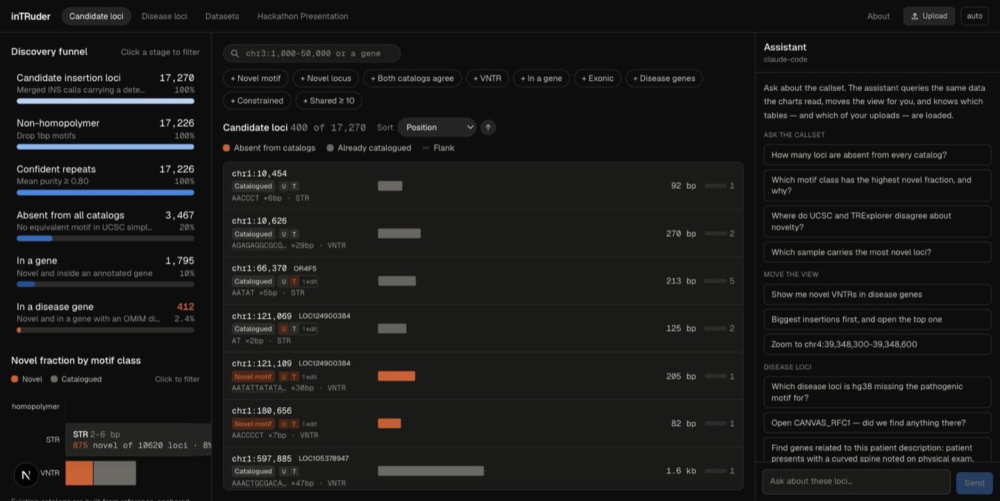
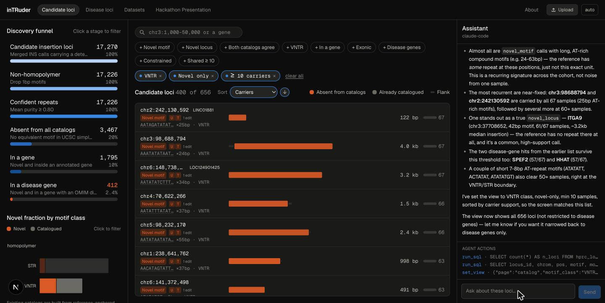
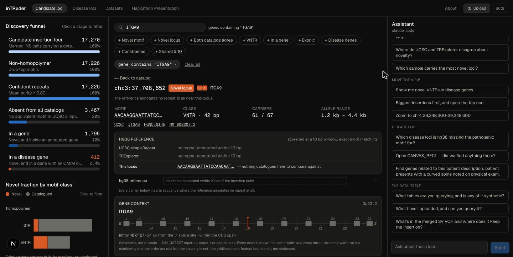
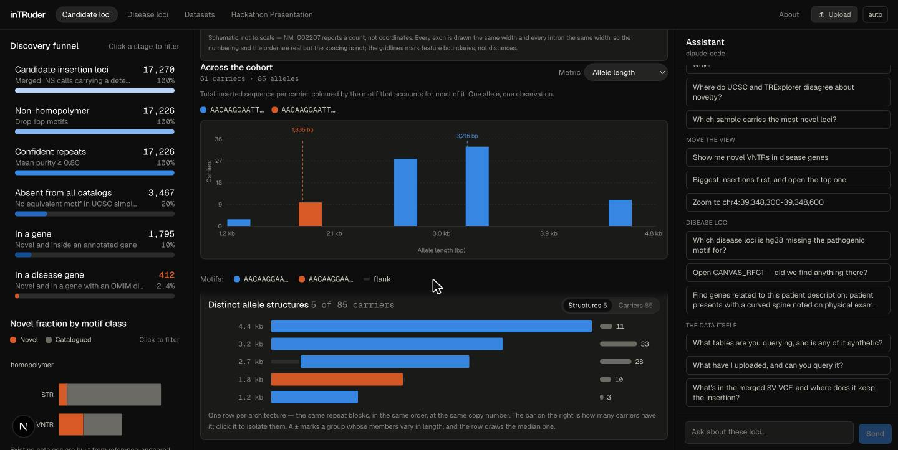
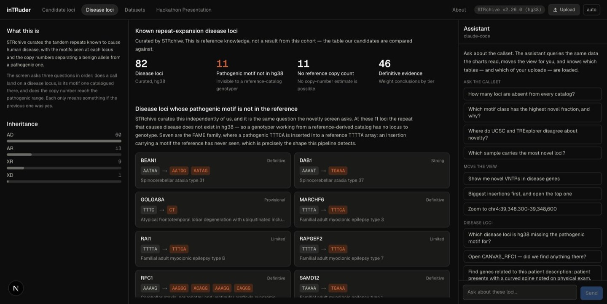
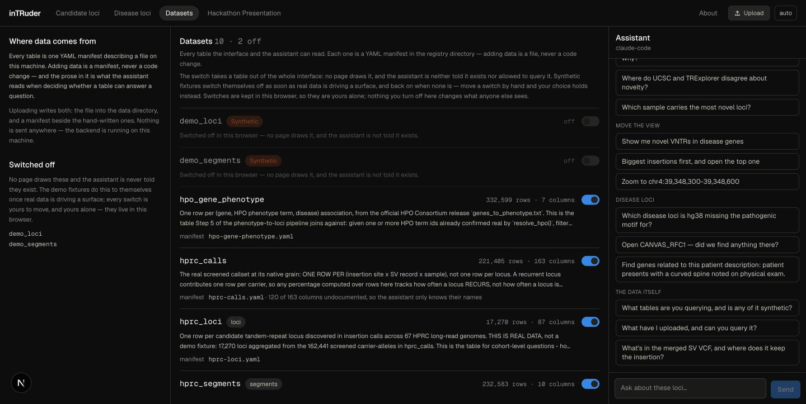

# inTRuder


<p align="center">

  

</p>

[Getting Started](docs/GETTING_STARTED.md) ·
[Methods](docs/Methods_overview.md) ·
[Documentation](#documentation) ·
[Contributing](CONTRIBUTING.md)

## Table of Contents

- [What is inTRuder?](#what-is-intruder)
- [Getting Started](#getting-started)
- [Web Interface](#web-interface)
- [Documentation](#documentation)
  - [Data](#data)
  - [Tools](#tools)
  - [Code and environments](#code-and-environments)
- [Repository Layout](#repository-layout)
- [Contributing](#contributing)
- [Team](#team)
- [AI Disclosure](#ai-disclosure)

## What is inTRuder?

Tandem repeat (TR) genotypers rely on a catalog of known loci and motifs, built by annotating
repeats in the reference genome. Any TR that's individual- or population-specific is invisible to
that catalog from the start. inTRuder looks for two kinds of novelty a reference-based genotyper
can't see:

- **Novel locus** — present in an individual, absent from the reference genome entirely.
- **Novel motif** — the locus exists in the reference, but the individual carries a different
  repeat motif there.

Finding these normally means assembling the whole genome just to surface non-reference sequence.
inTRuder takes a cheaper route: long-read structural variant (SV) callers already detect
insertions as a standard part of most long-read workflows, and an expanded TR is, by construction,
a repetitive subset of those insertions. Scanning the inserted sequence — instead of assembling
the whole genome — is enough to surface candidate TR expansions, including ones no existing
catalog knows about.

**Why inTRuder:**

- **Catches what reference catalogs miss** — flags loci and motifs absent from the reference
  genome, not just genotypes at sites the reference already knows about.
- **No assembly required** — reuses the insertion calls a long-read SV pipeline already produces
  (Sniffles2), instead of assembling each genome from scratch.
- **Explore results without a terminal** — a web interface renders every candidate locus, with an
  assistant that answers questions by querying the same tables you see.
- **Your data stays yours** — the web interface can run entirely on a local model (the Claude Code
  CLI, Ollama); nothing leaves the machine.
- **Clinical context built in** — candidates are compared against STRchive's curated disease-locus
  catalog and annotated with AnnotSV.

This repository holds the pipeline (Nextflow plus standalone Python CLIs), the web interface, and
the data and analysis code behind both. See the [Methods outline](docs/Methods_overview.md) for
the full write-up of each pipeline stage.

## Getting Started

**Prerequisites:** [uv](https://docs.astral.sh/uv/), Node.js 20+, and
[`just`](https://github.com/casey/just). Docker if you'd rather skip the toolchain, or if you're
running the Nextflow pipeline.

```bash
git clone https://github.com/collaborativebioinformatics/inTRuder.git
cd inTRuder
just setup     # uv sync for the pipeline, uv sync + npm install for the web app,
               # plus the synthetic demo dataset the interface opens on
just dev       # backend on :8000, frontend on :3000
```

Open [http://localhost:3000](http://localhost:3000).

Or skip the toolchain entirely and run it in containers:

```bash
docker compose up --build
```

That's enough to explore the web interface on the bundled demo data. Running the pipeline itself,
pointing either at your own data, and every `just` recipe are covered in the
**[Getting Started guide](docs/GETTING_STARTED.md)**.

## Web Interface

<p align="center">

  <b>See the tandem repeats no catalog knows about — then ask about them in plain English.</b>

  <br>

  <sub>Every candidate locus on one screen, filtered live, with an assistant reading the same information you are.</sub>

</p>

<p align="center">

  

</p>

<p align="center">

  

  

  

  

  

</p>

---

### Ask it in English



### Inspect Loci





### Compare Against STRchive



### Use Your Data



**Adding a dataset is one YAML file, no code changes.** Switch a table off and it leaves the
whole interface — no page draws it, and the assistant is not told it exists. Your files stay
where they are, and with a local model nothing leaves the machine at all.

---

Works with Anthropic, Google, OpenAI and Ollama — or with the Claude Code CLI you already have,
no key at all. The data views need no model whatsoever; only chat does.

## Documentation

Start with the **[Getting Started guide](docs/GETTING_STARTED.md)** for setup and running the
pipeline, or the **[Flowchart](docs/FLOWCHART.md)** for a visual overview of the pipeline. The
tables below cover everything else.

### Data


| Document                                                                    | Contents                                                                                                                              |
| --------------------------------------------------------------------------- | ------------------------------------------------------------------------------------------------------------------------------------- |
| [67-genome HPRC cohort](docs/data/67_genome_HPRC_cohort.md)                 | Cohort composition, read extraction and alignment, Sniffles2 SV calling and filtering, data availability                              |
| [UCSC hg38 Simple Repeats (TRF)](docs/data/UCSC_hg38_Simple_TRF_Repeats.md) | Reference TR annotation used for comparison — download, column schema, coordinate conventions, provenance                             |
| [`data/aws_hprc_cram.list`](data/aws_hprc_cram.list)                        | AWS S3 locations of the processed HPRC CRAM files                                                                                     |
| [`data/aws_giab_cram.list`](data/aws_giab_cram.list)                        | AWS S3 locations of the processed GIAB CRAM files                                                                                     |
| [`data/sv_output/`](data/sv_output/)                                        | Per-sample raw and filtered Sniffles VCFs, plus the merged multi-sample VCF subset                                                    |
| [Plotting inputs](docs/analysis/PLOTTING.md)                                | The uncommitted tables in `data/plots/` that the figures are drawn from — what each one is, which step produces it, how to regenerate |


### Tools


| Document                                              | Contents                                                                                                       |
| ----------------------------------------------------- | ----------------------------------------------------------------------------------------------------------------------------------------------------- |
| [Novelty screen](docs/tools/NOVELTY_SCREEN.md)        | Is this repeat absent from the reference? Catalogues, motif equivalence and tolerance, the known/novel verdict |
| [STRchive comparison](docs/tools/STRCHIVE_COMPARE.md) | Is it a known disease locus? Motif classes, allele-class thresholds, the annotated output table                |


### Code and environments


| Document                                             | Contents                                                                                                                                              |
| ----------------------------------------------------- | ----------------------------------------------------------------------------------------------------------------------------------------------------- |
| [Python source](src/python/README.md)                | uv-managed environment, adding dependencies, running scripts, linting and tests                                                                       |
| [Run programs on DNAnexus](docs/scripts/DNANexus.md) | `scripts/dnanexus/dx-*.sh`: start a machine, get a terminal or run one program on it, then stop the machine. Token setup, options, and instance types |
| [R source](src/R/README.md)                          | renv-managed environment, `renv::restore()`, snapshotting new packages                                                                                |
| [Notebooks](notebooks/README.md)                     | Jupyter and R Markdown / Quarto notebooks for exploration and reporting                                                                               |


## Repository Layout

```
inTRuder/
├── src/
│   ├── python/intruder/     # the pipeline, as one installed package (uv-managed)
│   │   ├── trcore/             # shared primitives — coords, motifs, downloads
│   │   ├── pipeline/           # the steps: trf, novelty, strchive, annotation
│   │   └── analysis/           # post-hoc analysis of pipeline output
│   └── R/                   # R analysis code (renv-managed)
├── scripts/                 # every shell script in the repo
│   ├── dnanexus/               # rent a DNAnexus box, run something, terminate it
│   └── merge-SV/               # Sniffles single- and multi-sample SV merging runs
├── workflows/               # Nextflow entrypoint (main.nf, nextflow.config)
├── pipelines/               # Nextflow subworkflows and their scripts
├── notebooks/               # Jupyter and R Markdown / Quarto notebooks
├── frontend/                # Next.js web interface (proof of concept)
├── backend/                 # FastAPI + LangGraph service (its own uv project)
├── docker/                  # Container images for frontend/backend
├── data/                    # Sample lists, SV output, catalogs (mostly gitignored)
├── docs/                    # Getting-started guide, data, tool and methods documentation
├── tests/python/            # Python tests, mirroring src/python/intruder/
└── justfile                 # task runner — `just` lists all recipes
```

Where code goes: Python in `src/python/intruder/`, R in `src/R/`, shell in
`scripts/`, Nextflow in `workflows/` and `pipelines/`. Tests never sit beside the
code they cover — they mirror it under `tests/`.

## Contributing

See [CONTRIBUTING.md](./CONTRIBUTING.md) for the quick workflow on submitting changes via a pull request.

## Team

Harriet Dashnow, Akshay Kumar Avvaru, Bharati Jadhav, Amit R Indap, Garth Kong, Achisha Saikia,
Sriram Sudarsanam, Andrew Scouten, Jordi Valls, Ammara Saleem, Elbay Aliyev, Garrison Arner, Gavin Monahan, Anukrati Sharma, Liedewei Van de Vondel, Ramakrishnan Rajagopalan, Divya Kalra, Chantera Lazard, Taimoor Khan and Medhat Mahmoud.

## AI Disclosure

Artificial intelligence tools, including large language models such as Claude Code, were used
during the development of this project to support writing, clarify technical concepts, and
assist in generating code and tests. These tools served as an aid for idea refinement, debugging,
and improving the readability of explanations and documentation. All AI-generated text and code
were thoroughly reviewed, verified for correctness, and understood in full — each change went
through a pull request reviewed by a member of the team above — before being incorporated into
this work. The responsibility for all final decisions, interpretations, and implementations
remains solely with the contributors.