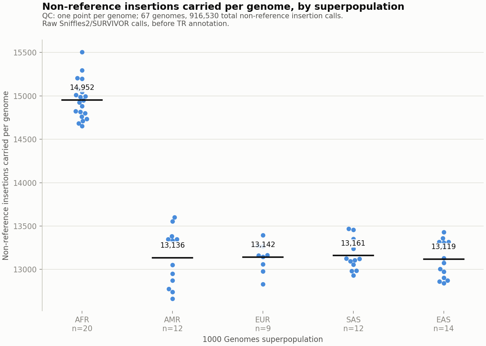
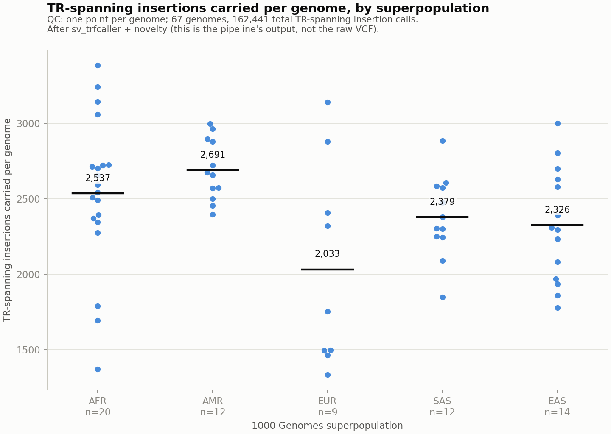

# Insertions carried per genome, by ancestry (QC)

*Generated 2026-08-28 16:10 UTC by `src/python/reporting/ancestry_report.py` from `hprc_multisample.INS_comp.vcf` and `05_hprc_multisample.tsv` (67 HPRC genomes).*

Descriptive QC only, no significance testing. Both plots share the same superpopulation order, axis style, and colour so they can be compared directly -- what changes between them is entirely due to the TR pipeline (`sv_trfcaller` + `novelty`), not a different cohort or axis.

## Summary

| superpop   |   n_genomes |   n_insertions_raw_mean |   n_insertions_raw_median |   n_insertions_tr_mean |   n_insertions_tr_median |
|:-----------|------------:|------------------------:|--------------------------:|-----------------------:|-------------------------:|
| AFR        |          20 |                   14952 |                     14935 |                   2537 |                     2569 |
| AMR        |          12 |                   13136 |                     13192 |                   2691 |                     2666 |
| EUR        |           9 |                   13142 |                     13162 |                   2033 |                     1754 |
| SAS        |          12 |                   13161 |                     13115 |                   2379 |                     2342 |
| EAS        |          14 |                   13119 |                     13104 |                   2326 |                     2303 |

## Before the pipeline: raw insertion calls

The full merged callset (`SVTYPE=INS`, non-reference genotype), independent of whether an insertion contains a tandem repeat.

## After the pipeline: TR-spanning insertion calls

Same 67 genomes, counted from this repo's own output (`sv_trfcaller` + `novelty annotate`). Counted as distinct `(sample, SVID)` pairs rather than raw rows, since `sv_trfcaller.py` currently double-emits every repeat call for homozygous-alt genotypes (see `issue_duplicate_rows.md`) -- counting raw rows would overstate per-sample totals by ~36%.

## What changes between the two

Before the pipeline, AFR genomes clearly carry the most non-reference insertions of any group -- a well-known effect of calling structural variants against a reference genome that under-represents African genetic diversity. After restricting to TR-spanning insertions, that ordering changes (AMR leads on this smaller, noisier subset) and the gap narrows substantially. Whether that shift reflects something real about which insertions are TR-containing, or is just sampling noise on a ~15x smaller subset, isn't something this QC pass can answer -- it only establishes that the two views disagree and both denominators are needed to see it.
