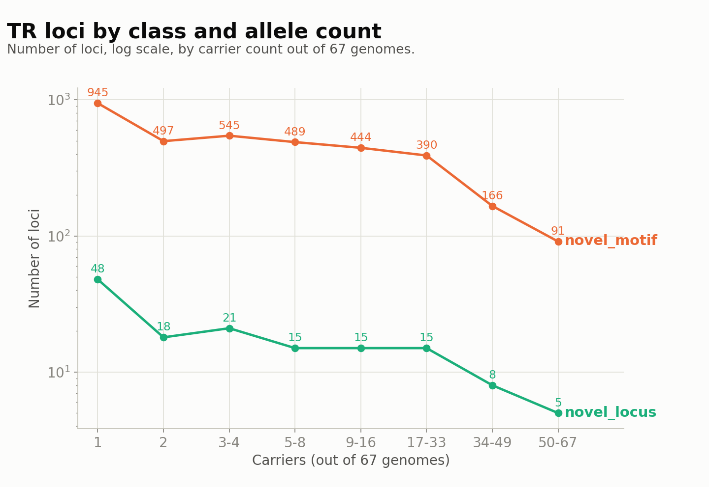
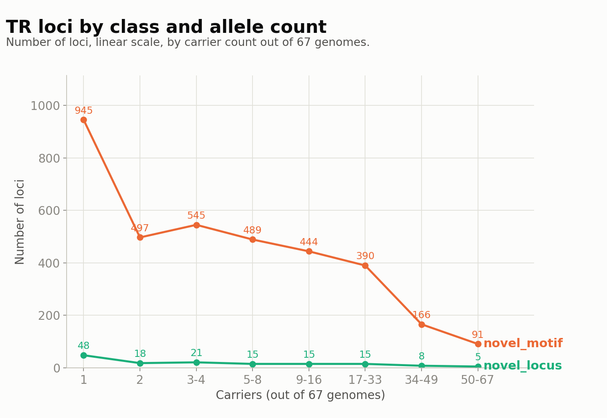

# TR loci by novelty class and allele count

*Generated 2026-08-28 17:41 UTC by `src/python/reporting/novelty_frequency_report.py` from `05_hprc_multisample.tsv` (67 HPRC genomes, 17,270 true loci).*

Locus = `(chrom, position)`, not `SVID`: this merged VCF assigns SVID per-sample-call, so the same locus can carry different SVIDs across carriers. Grouping by SVID inflates locus count (21,424 vs 17,270 true) and undercounts carrier frequency for ~17% of loci -- every count below uses the corrected position-based definition. Novelty class per locus is the majority verdict across its carriers (97.2% already agree unanimously).

Carrier count is binned by doubling (1, 2, 3-4, ... 50-67) rather than percentages, since 67 doesn't divide into round percentage cutoffs.

| bin   |   known |   novel_motif |   novel_locus |
|:------|--------:|--------------:|--------------:|
| 1     |    3719 |           945 |            48 |
| 2     |    1820 |           497 |            18 |
| 3-4   |    1954 |           545 |            21 |
| 5-8   |    1901 |           489 |            15 |
| 9-16  |    1661 |           444 |            15 |
| 17-33 |    1619 |           390 |            15 |
| 34-49 |     660 |           166 |             8 |
| 50-67 |     224 |            91 |             5 |

Both classes decline sharply from rare to common -- the standard site-frequency-spectrum shape, not specific to novelty (`known` loci decline the same way, see table). This is raw count, not rate: the *share* of loci that are novel stays flat across bins (~20% novel_motif, <1.2% novel_locus everywhere), matching the filtered result in `feature/population-structure`'s methods doc.
