# Novelty QC Analysis

Dataset: HPRC 67 samples merged with Sniffles, run with TRF, filtered to generate novel tandem repeats.
Catalog of every plot and table produced by [analyze_novelty.py](../analyze_novelty.py),
with a concise summary of what each one shows.
For methodology decisions, caveats, and the full analysis log, see [data_summary_notes.md](../data_summary_notes.md).

## Background

- **Data**: ONT long-read SV calls (Sniffles2) for 67 HPRC/1000G samples, aligned to GRCh38,
  filtered to insertions and run through TRF. 221,369 TR calls across chr1-22/X/Y.
- **Novelty**: each TR call is checked by **two independent methods** — UCSC Simple Repeats and
  TRExplorer — yielding `known`, `novel_motif`, or `novel_locus`. The two methods agree only
  73.5% of the time and are reported side by side throughout.
- **Ancestry**: samples labeled with IGSR/1000G superpopulation (AFR/AMR/EAS/EUR/SAS).
  Group sizes unequal (AFR n=20 to EUR n=9).
- **Locus identity** is `(chrom, ins_coord)`, not `SVID` — 261 unique SVIDs map to only 229
  unique positions within `novel_locus`.

---

## 1. Novelty burden by ancestry

### 01 — Novelty by ancestry (stacked)

Stacked bar chart, one panel per novelty method (UCSC, TRExplorer), showing pooled raw TR-call
counts per ancestry group broken down by novelty category. Each bar is annotated with its group's
sample count.

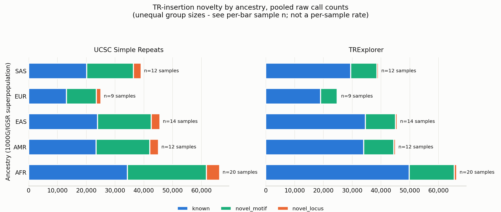

### novelty_by_ancestry_loci_table — Distinct loci by ancestry

Distinct loci (`chrom:ins_coord`) per ancestry group × novelty method. **Not additive across
populations**: a locus carried by samples from more than one group is counted once per group.

| novelty_source | population | n_samples | known_n_loci | novel_locus_n_loci | novel_motif_n_loci |
|---|---|---|---|---|---|
| ucsc_novelty | AFR | 20 | 7,099 | 689 | 5,480 |
| ucsc_novelty | AMR | 12 | 4,771 | 446 | 3,649 |
| ucsc_novelty | EAS | 14 | 4,614 | 448 | 3,473 |
| ucsc_novelty | EUR | 9 | 3,876 | 390 | 3,042 |
| ucsc_novelty | SAS | 12 | 4,513 | 441 | 3,540 |
| trexplorer_novelty | AFR | 20 | 10,045 | 162 | 3,045 |
| trexplorer_novelty | AMR | 12 | 6,697 | 104 | 2,060 |
| trexplorer_novelty | EAS | 14 | 6,512 | 103 | 1,920 |
| trexplorer_novelty | EUR | 9 | 5,536 | 90 | 1,673 |
| trexplorer_novelty | SAS | 12 | 6,406 | 111 | 1,958 |

---

## 2. Locus/motif landscape overview

*Whole dataset, all three novelty categories combined — not ancestry-specific.*

### 03 — Motif length distribution

Distribution of `motif_length` (bp): 1-6bp on a linear axis (where nearly all calls live) and
7bp+ on a linear axis, showing the true right-skew shape (sharp peak ~20-40bp, long tail to 392bp).

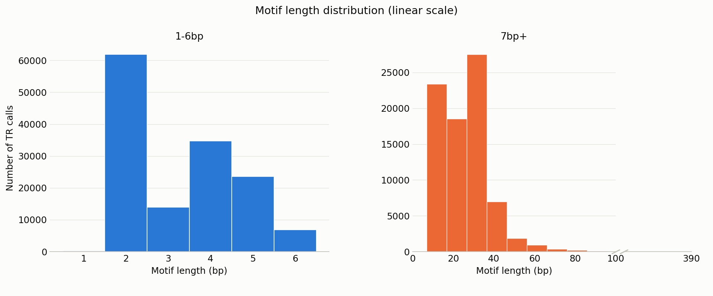

### 04 — Repeat length and copy number

Repeat tract length (`rep_length`, bp) and copy number (`rep_units`), both log-binned.
Tract length peaks ~60-150bp; copy number peaks ~20-40 repeats.

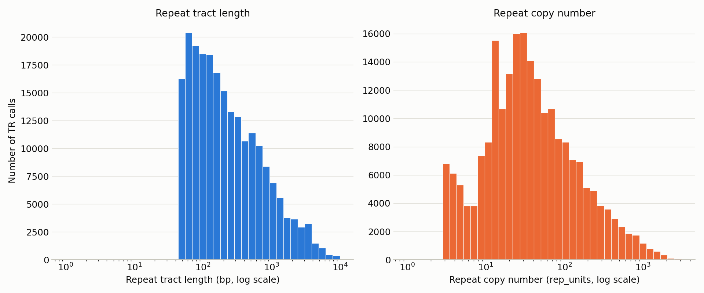

### 05 — Purity

`purity` (TRF's measure of repeat-motif match quality) and `insertion_purity` (fraction of
insertion that is repeat sequence). `purity` is floored at 0.800 by an upstream filter — that's
a real cutoff, not truncated data.

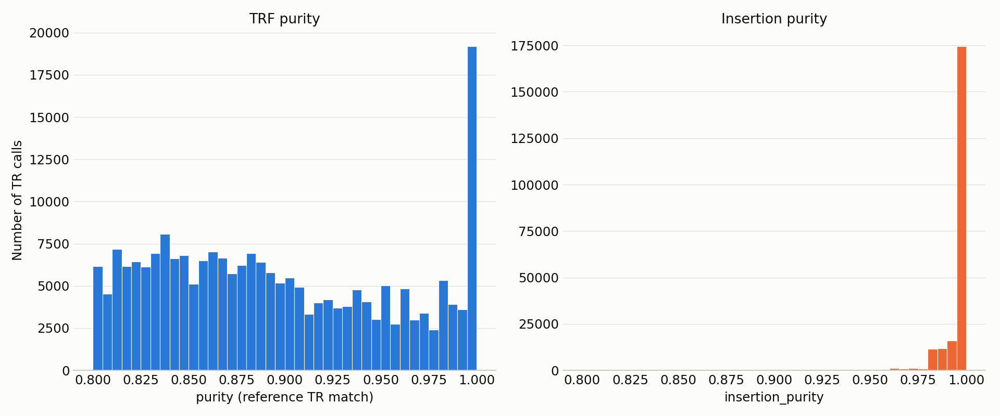

### 06 — Top canonical motifs by unique loci

Most frequent `canonical_motif` values ranked by distinct loci. `AT` dominates; some motifs recur
heavily at few positions while others spread thinly across many.

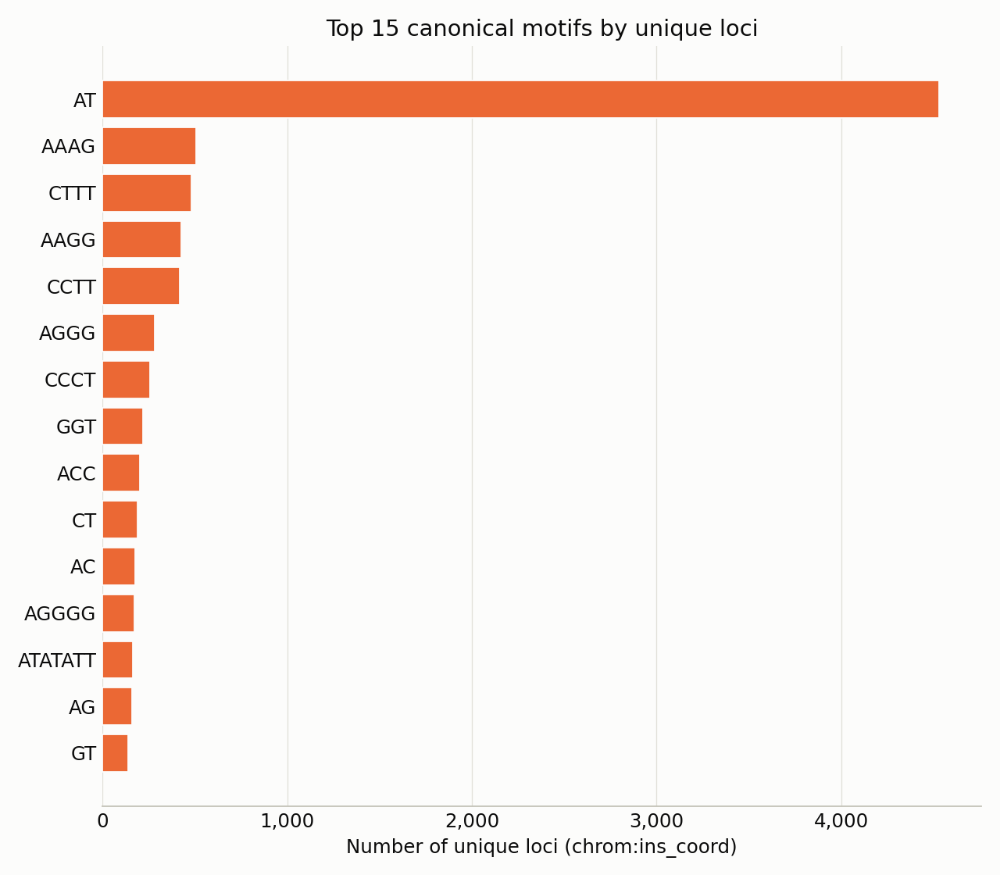

### 07 — Overall novelty split

Whole-dataset novelty proportions (donut), UCSC vs TRExplorer side by side.

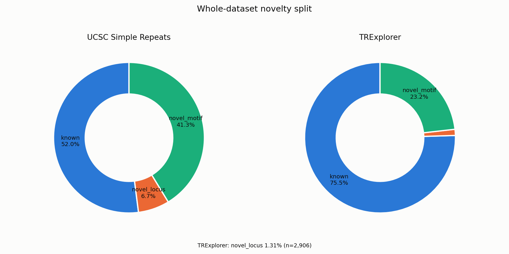

### 08 — Calls per chromosome

Raw TR-call counts per chromosome (chr1-22, X, Y). Roughly tracks chromosome length; chrY is
low because not all 67 samples are male.

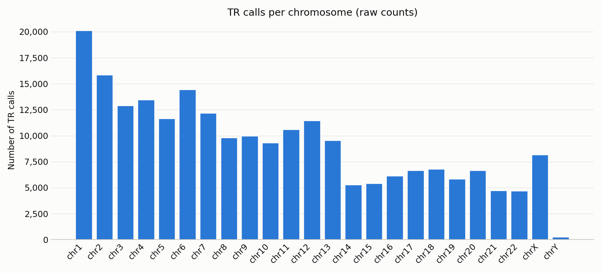

### 09 — Repeat coverage

`repeat_coverage` — the fraction of each insertion's sequence explained by the identified repeat.
Strongly right-skewed toward 1.0.

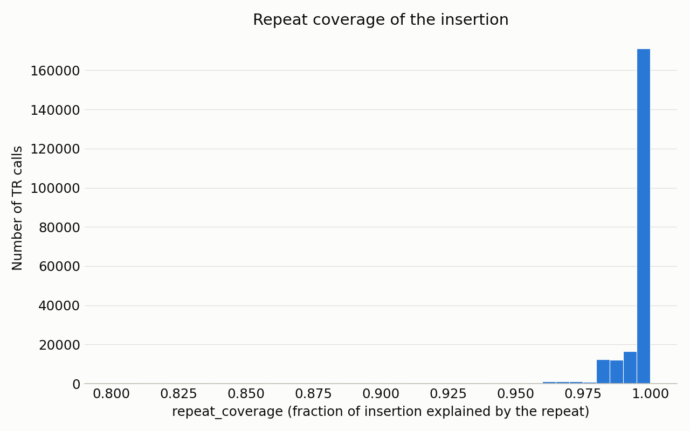

---

## 3. `novel_locus` deep dive (TRExplorer)

*TRExplorer's `novel_locus` category: 2,906 calls across 229 unique loci — positions TRExplorer's
reference catalog doesn't contain at all.*

### novel_locus_summary_by_trexplorer_category — Metrics by novelty category

Motif/purity/length/depth metrics for `novel_locus`, side by side with `known` and `novel_motif`
for contrast. Key contrasts: `novel_locus` repeat tracts run longer (median 217bp vs 154bp for
`known`), and purity is slightly lower (0.887 vs 0.893), consistent with harder-to-resolve regions
not yet in TRExplorer's catalog. Top motifs skew toward longer/more complex sequences — e.g. a
42bp motif ranks 84th overall but 3rd within `novel_locus`.

| metric | known | novel_locus | novel_motif |
|---|---|---|---|
| `n_calls` | 167,082 | 2,906 | 51,381 |
| `pct_of_total` | 75.48 | 1.31 | 23.21 |
| `n_unique_samples` | 67 | 67 | 67 |
| `n_unique_loci` | 13,450 | 229 | 4,080 |
| `n_unique_canonical_motif` | 2,743 | 155 | 2,760 |
| `motif_length_mean` | 8.2 | 15.2 | 20.5 |
| `motif_length_median` | 4.0 | 5.0 | 20.0 |
| `purity_mean` | 0.893 | 0.887 | 0.902 |
| `purity_median` | 0.882 | 0.873 | 0.901 |
| `insertion_purity_mean` | 0.995 | 0.983 | 0.996 |
| `rep_length_mean` | 449.6 | 844.9 | 675.4 |
| `rep_length_median` | 154.0 | 217.0 | 307.0 |
| `rep_units_mean` | 110.6 | 150.6 | 50.7 |
| `rep_units_median` | 37.0 | 27.0 | 20.0 |
| `repeat_coverage_mean` | 0.995 | 0.973 | 0.994 |
| `depth_mean` | 38.7 | 43.1 | 40.6 |
| `depth_median` | 36.0 | 36.0 | 36.0 |

### novel_locus_trexplorer_most_recurrent_loci — Top 10 most recurrent loci

The 10 loci (by `chrom:ins_coord`) recurring across the most distinct samples within `novel_locus`.
The top locus (chr7:62,272,393, `ATTTC` motif) appears in 65 of 67 samples, showing this category
is concentrated on a small, recurrent set rather than 2,906 independent events.

| locus | canonical_motif | motif_len | n_samples | n_calls |
|---|---|---|---|---|
| `chr7:62272393` | `ATTTC` | 5 | 65 | 65 |
| `chr16:34066322` | `AATGG` | 5 | 64 | 91 |
| `chr3:37708652` | `AACAAGGAATTATCCAACAATGCACAGGACAGCTCCCCACAC` | 42 | 61 | 149 |
| `chr3:28238930` | `AATAT` | 5 | 58 | 116 |
| `chrX:128469427` | `AT` | 2 | 53 | 106 |
| `chr4:14726288` | `ACATTT` | 6 | 50 | 97 |
| `chr1:108689608` | `AT` | 2 | 50 | 90 |
| `chr13:24052836` | `C` | 1 | 48 | 96 |
| `chr10:2562627` | `ACATATATAT` | 10 | 44 | 70 |
| `chr9:121895759` | `GT` | 2 | 44 | 87 |

### Depth outliers (per call)

Histogram + boxplot of sequencing depth per call. 292 of 2,906 calls fall outside the whiskers;
one extreme case hits 5,730x (median 36x), flagging likely repetitive/multi-mapping regions.

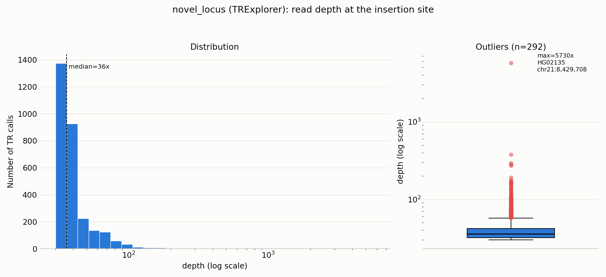

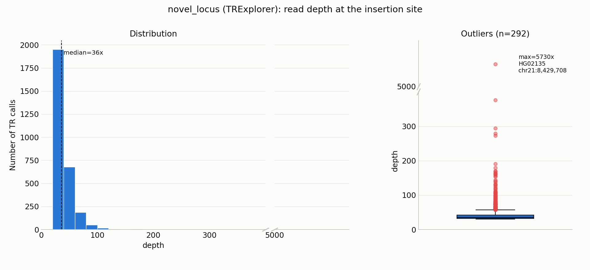

### Depth distribution (per locus)

Depth aggregated per locus (median depth per unique position). Depth outliers concentrate among
low-recurrence loci; loci shared across 40-65 samples all sit at normal depth (~30-50x).
Supports treating outliers as technical artifacts.

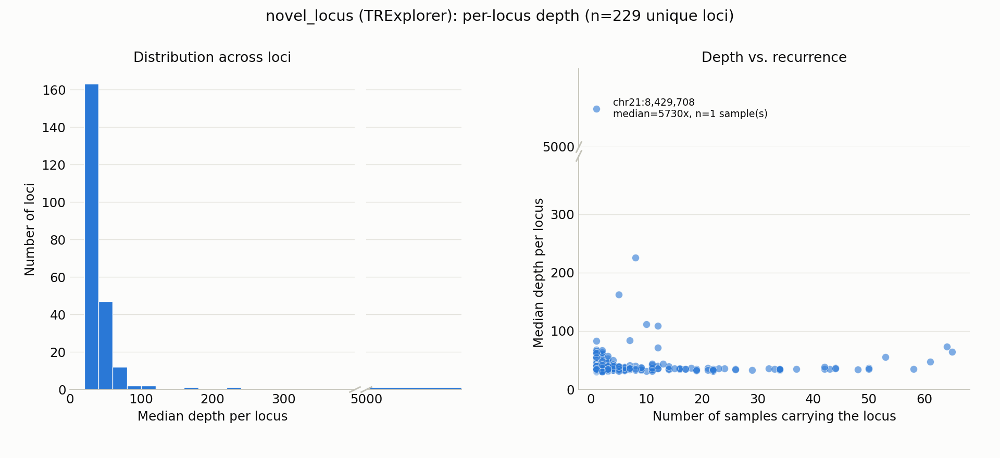
