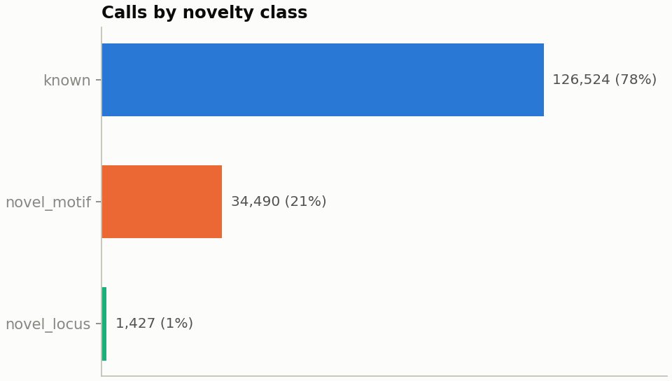
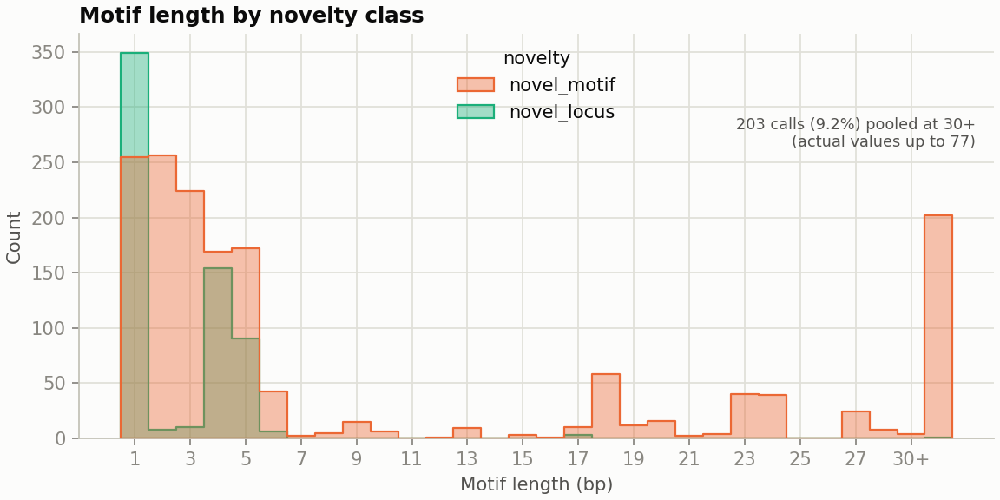
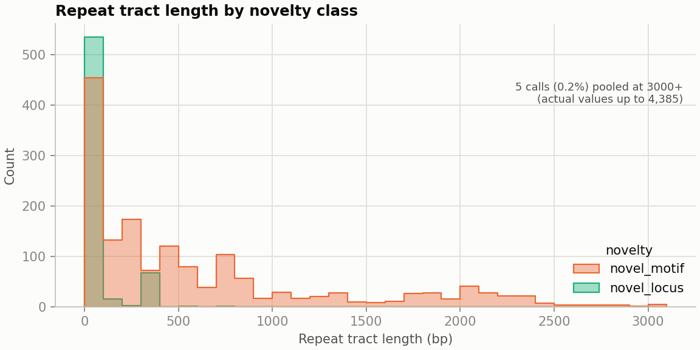
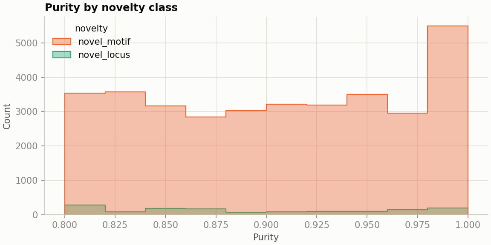
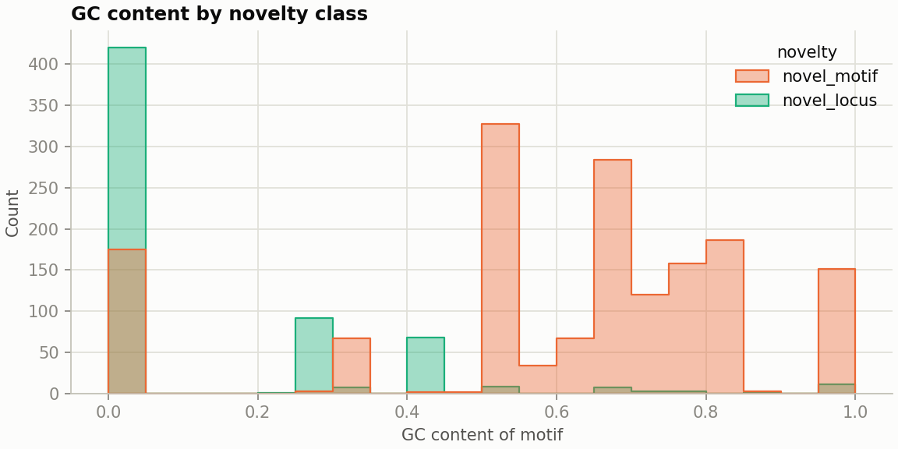

# Population-level TR distributions by novelty class

*Generated 2026-08-28 18:03 UTC by `src/python/reporting/population_report.py` from `05_hprc_multisample.tsv` (162,441 TRF calls across 17,270 loci; locus = chrom+position, not SVID -- see [novelty_by_allele_count.md](novelty_by_allele_count.md)).*

Colours follow the same fixed palette as [`notebooks/novel_tr_results.ipynb`](../../notebooks/novel_tr_results.ipynb): one novelty class, one colour, everywhere. Distributions below the summary chart are `novel_motif` vs `novel_locus` only (`known` excluded, not of interest here), shown as raw counts (not density) — the two classes differ by ~24x in size, so absolute magnitude matters, not just shape.

## Summary

| novelty     |      n | %     |   median motif_length |   median rep_length |   median purity |   median gc_content |
|:------------|-------:|:------|----------------------:|--------------------:|----------------:|--------------------:|
| known       | 126524 | 77.9% |                     4 |                 147 |           0.887 |               0.25  |
| novel_motif |  34490 | 21.2% |                    22 |                 306 |           0.906 |               0.226 |
| novel_locus |   1427 | 0.9%  |                     5 |                  94 |           0.879 |               0.188 |

## Motif length

Values at or above 30bp are pooled into the `30+` bucket and called out with an annotation (10,306 calls, 28.7% of all calls, actual motif lengths run up to 392bp) — the underlying summary table above is exact. An earlier version of this chart used a fixed axis range that cut the view off at 32bp without pooling the overflow, which silently dropped that many calls from the plot entirely.

## Repeat tract length

Values at or above 3000bp are pooled into the `3000+` bucket the same way (1,583 calls, 4.4% of all calls; actual repeat tract lengths run up to 9,888bp).

## Purity

Median purity by class is in the summary table above. This matters for interpreting the purity filter used downstream (`src/python/filter/filter_ins_trf.py`, min purity 0.7): the shape of each class's distribution near that threshold determines how much of it survives filtering, not just the median.

## GC content

GC content is the fraction of G/C bases in the repeat motif itself (`(motif.count('G') + motif.count('C')) / len(motif)`), bounded in [0, 1] by definition — no capping needed. An earlier version of this chart (`notebooks/pop_viz.ipynb`) computed `motif.str.count('GC') * rep_units` — the literal substring count scaled by copy number — which is unbounded and does not measure base composition; that computation has been replaced here.

